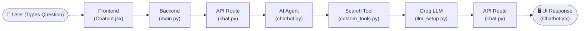

# User Perspective - Linear Workflows

These diagrams show a simple, straight-line journey of how the data travels file-by-file starting from the User.

## 1. Chatbot Workflow

## 2. File Upload Workflow (PDF/Excel)

```mermaid
flowchart LR
    User(["👤 User (Uploads File)"]) --> F["Frontend\n(UploadPage.jsx)"]
    F --> M["Backend\n(main.py)"]
    M --> U["API Route\n(upload.py)"]
    U --> G["Pipeline\n(graph.py)"]
    G --> A1["Agent 1\n(extractor.py)"]
    A1 --> A2["Agent 2\n(validator.py)"]
    A2 --> A3["Agent 3\n(detector.py)"]
    A3 --> U2["API Route\n(upload.py)"]
    U2 --> DB["Database\n(supabase.py)"]
    DB --> UI(["🖥️ UI Success\n(UploadPage.jsx)"])
```

